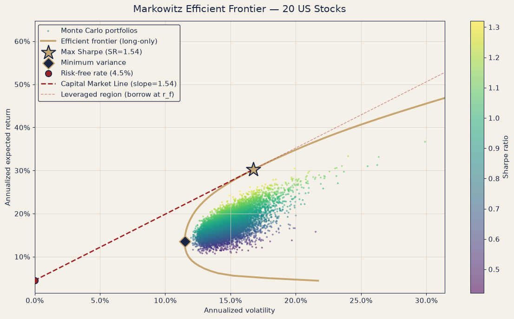
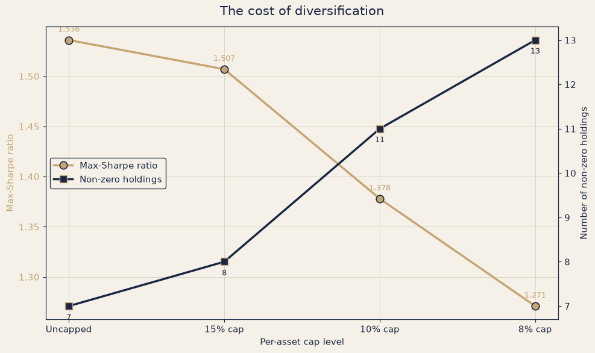
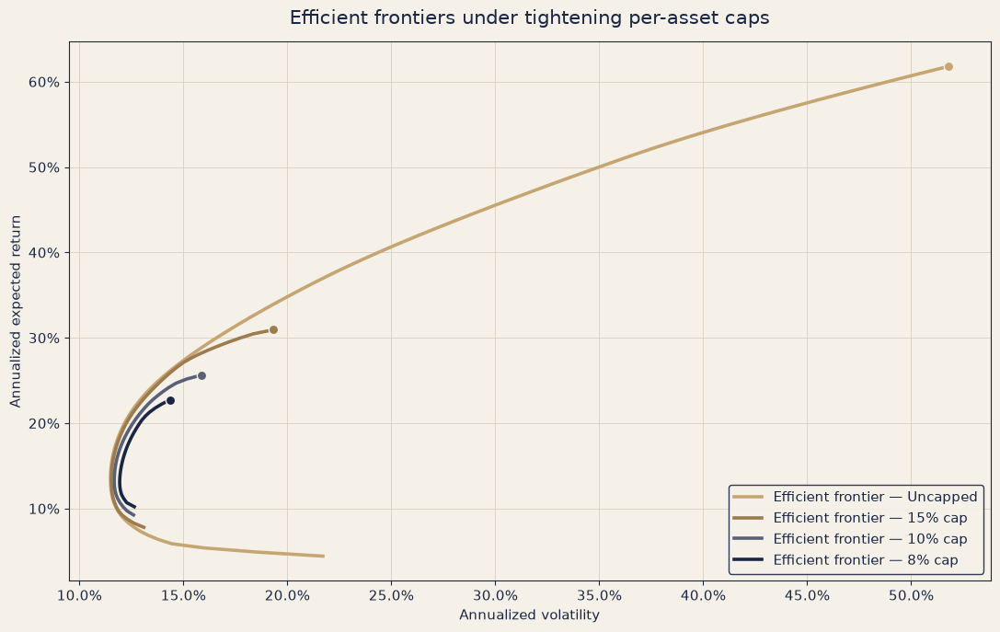
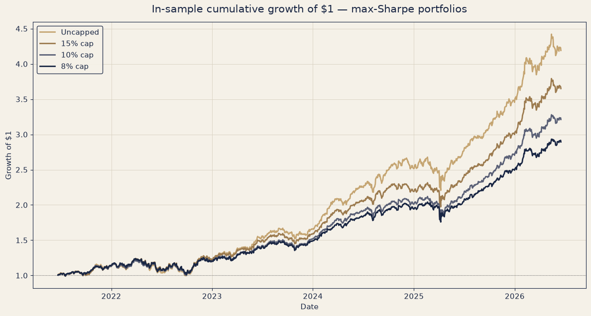
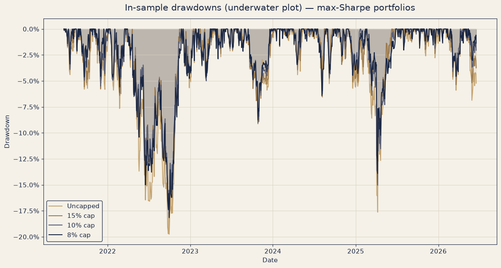
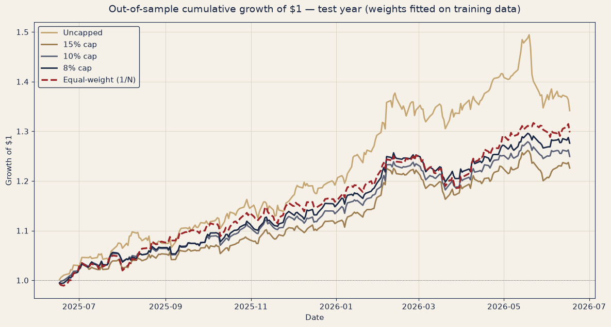
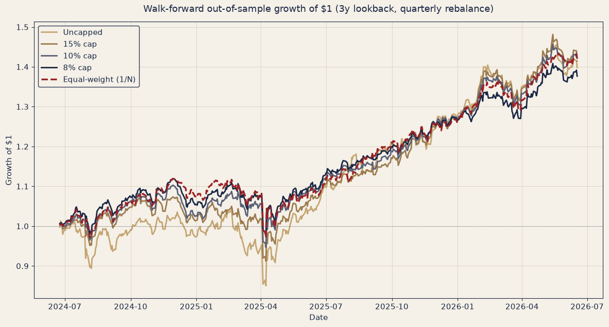

# Markowitz Mean-Variance Portfolio Optimization — 20 US Stocks

A rigorous, end-to-end study of Markowitz mean-variance optimization on a 20-stock US equity
universe. The project builds the efficient frontier and Capital Market Line, diagnoses the
concentration problem of unconstrained optimization, imposes per-asset weight caps to quantify the
"cost of diversification," and then stress-tests every portfolio with an in-sample drawdown analysis,
a single train/test split, and a rolling **walk-forward backtest** benchmarked against a naive
equal-weight (1/N) portfolio. The headline result: the textbook "optimal" portfolio is the *worst*
performer out-of-sample, and 1/N is hard to beat.

## Research question & motivation

Mean-variance optimization promises the mathematically optimal risk-return trade-off. But it is
notoriously fragile: it treats noisy historical estimates of returns and covariances as if they were
the truth, and tends to concentrate capital in a handful of names that merely *looked* best in the
sample. This project asks a practical question:

> **Does Markowitz optimization actually deliver superior risk-adjusted performance out-of-sample —
> and if not, what simple constraints (or benchmarks) do better?**

To answer it, the analysis moves deliberately from textbook theory (the frontier) to honest
evaluation (walk-forward, out-of-sample), showing where the theory breaks down and why.

## Asset universe

20 large-cap US stocks across sectors: AAPL, MSFT, NVDA (tech); PG, KO, WMT (consumer defensive);
AMZN, HD (consumer cyclical); JNJ, UNH, MRK (healthcare); JPM, BRK-B, V (financials); XOM, CVX
(energy); CAT, HON (industrials); GOOGL (communication); VZ (telecom). Data: ~5 years of daily
adjusted closes from Yahoo Finance (`yfinance`). Returns and covariances are annualized by 252; the
risk-free rate is 4.5%; portfolios are long-only and fully invested.

## Methodology

The notebook ([`notebooks/markowitz.ipynb`](notebooks/markowitz.ipynb)) proceeds in stages:

1. **Efficient frontier & Capital Market Line.** A 10,000-portfolio Monte Carlo cloud, the long-only
   efficient frontier solved by constrained optimization (SLSQP), the minimum-variance and
   maximum-Sharpe (tangency) portfolios, and the CML with its lending/leveraged regions.

   

2. **Concentration diagnosis.** The unconstrained max-Sharpe portfolio is highly concentrated — a
   handful of names, a single weight near 27%. This is the fragility that the rest of the project
   probes.

3. **Per-asset caps & the cost of diversification.** Re-solving with per-asset upper bounds (15%,
   10%, 8%) forces diversification. As the cap tightens, the achievable Sharpe falls while the number
   of holdings rises — the explicit price paid for a less concentrated book.

   
   

4. **In-sample realized performance & drawdowns.** Replaying each optimized portfolio over the same
   history (explicitly flagged as in-sample) to illustrate the realized journey and underwater
   profiles.

   
   

5. **Out-of-sample test (train/test split).** Weights are fitted on the first 4 years and evaluated,
   frozen, on the final year — plus a 1/N benchmark. The first honest look at generalization.

   

6. **Walk-forward backtest.** A 3-year rolling lookback re-optimized quarterly: at each rebalance the
   portfolios are re-fit on the trailing 3 years, held for 3 months, and the out-of-sample pieces are
   stitched into one continuous series. Includes per-period Sharpe win-counts vs. 1/N.

   

All summary tables report total return, CAGR, realized volatility, Sharpe (rf = 4.5%), Sortino,
Calmar, and maximum drawdown.

## Key findings

- **The in-sample ranking reverses out-of-sample.** In-sample, the unconstrained max-Sharpe portfolio
  dominates (Sharpe ≈ 1.54). Out-of-sample it becomes the **worst risk-adjusted performer** —
  walk-forward Sharpe of just **0.79**, the highest volatility, and the deepest drawdown (≈ −18%).
  Concentration that paid in-sample becomes a liability on unseen data: a textbook case of
  overfitting estimation noise.

- **Equal-weight (1/N) wins on consistency.** Across the walk-forward, 1/N posts the best risk-adjusted
  metrics (Sharpe ≈ 1.10, best Sortino and Calmar) and takes the most individual rebalance windows.

  | Best Sharpe per window (8 windows) | Wins |
  |---|---|
  | Equal-weight (1/N) | 3 |
  | 15% cap | 2 |
  | 8% cap | 1 |
  | 10% cap | 1 |
  | Uncapped | 1 |

- **Caps act as regularization.** The capped portfolios land between the unconstrained optimizer and
  1/N — tighter caps reliably improve out-of-sample Sharpe, Sortino, Calmar, and drawdown, confirming
  that constraining concentration hedges against estimation error.

- **Bottom line.** More optimization ≠ better results. The simplest strategy (1/N) and the most
  *constrained* optimizers generalize best; the unconstrained "optimum" generalizes worst.

## How to run

```bash
# 1. Clone
git clone https://github.com/<your-username>/markowitz-portfolio.git
cd markowitz-portfolio

# 2. Create a virtual environment (recommended)
python -m venv .venv
source .venv/bin/activate        # Windows: .venv\Scripts\activate

# 3. Install dependencies
pip install -r requirements.txt

# 4. Launch the notebook
jupyter notebook notebooks/markowitz.ipynb
```

Run the cells top to bottom. Prices are downloaded fresh from Yahoo Finance at runtime — no data
files are stored in the repo, so exact figures will shift slightly as the trailing 5-year window
moves. The narrative conclusions are robust to this.

## Limitations

- **Single historical path.** The study evaluates one realized history of one 20-stock universe;
  results are not guaranteed to generalize to other periods, assets, or regimes.
- **In-sample optimization bias.** Section-13 results are explicitly in-sample and shown only to
  illustrate realized risk/return — they are not predictive.
- **Limited test windows.** With ~5 years of data and a 3-year lookback, the walk-forward has only
  **8 rebalance windows** — enough to be illustrative, not enough for statistical significance.
- **Estimation method.** Expected returns and covariances are simple historical estimates; no
  shrinkage, factor models, or transaction costs are modeled.

## License

Released under the [MIT License](LICENSE).

---

*This is independent research for educational purposes only. It is **not** investment advice, a
recommendation, or a solicitation to buy or sell any security. Past performance does not indicate
future results.*
